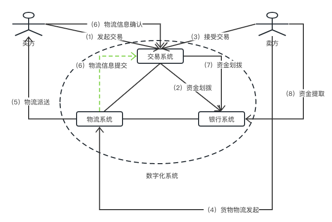

# 什么是区块链

## 区块链的起源

&#x20;   要想知道什么是区块链，我们有必要从区块链的起源谈起，即为什么要有区块链呢？

&#x20;   <<纽约客>> 在1993 年刊登过漫画家彼得.施泰纳的一幅漫画，上面写着“在互联网上，没有人知道你是一条狗”。在没有KYC的情况下，中心化的系统根本不知道它的用户到底是好人、还是坏人，那么在这个系统上的所有交易如何保护诚信用户、惩诫欺诈用户，完全是靠中心化系统（可信任的第三方交易系统）。在这个系统上，买方或卖方的抵赖行为，完全由中心化系统来仲裁。那么第三方交易如何解决买方和卖方抵赖行为呢：

1. 针对买（卖）方的抵赖行为，采用托管支付。先用托管账户将用户的资金暂时划拨到托管账户【如图所示资金划拨】。
2. 只有等到真正的物流到了买方，买方确认了收到货之后，中心化系统（交易系统）再将托管账户上的资金划拨到卖方上【如图所示 （6）、（7）】。
3. （1）、（2）可以很好地保护了买方，但是对于买方的抵赖行为，它可以在收到货之后进行抵赖，比如退货或者仲裁没有收到货。目前这个问题的解决方式是把物流链的信息提交到第三方交易系统，中心化系统接收到物流确认信息后，验证信息的准确性之后，再执行（2）的资金划拨【如图虚线所示（6）物流信息提交】。物流链信息的准确性由物流系统来保障。如果在极端的情况下，买方是一个极度无赖，他提出配送环节中，没有可信度证据证明他收到货（货没有破损）了。那么这个问题必须通过双方确认物流信息的可信来解决。
4. 在（1）、（2）、（3）的场景下，还无法确保真实的资金流在买、卖双方之间转移的可信性。传统的解决方式，背后其实还是要依赖另一个可信的中心化系统（银行）【如图（2）、（7）、（8）所示资金流的可信由银行系统进行保障】。传统可信交易，是依赖于中心化系统（交易系统、银行系统、物流系统）构建、维护的账本（记录），各个环节账本的可信由相应的中心化系统来保障，如图所示。

<figure><figcaption>
传统的可信交易系统
</figcaption></figure>

从传统的可信交易解决方式来看，要实现可信的交易，必须解决可信的交易信息流、可信的物流、可信的资金流。当资金不再用纸钞等实物货币，而变为数字货币，那么可信的交易系统，就剩下如何解决物流的可信。物流的可信可以在物流的最后阶段转化为双方密钥确认的信息流，那么整个交易链串在一起，就是一个可信的过程。综上所述，我们可以看出可信的交易系统需要解决如下的问题：

1. 数字化各个关键环节（货币数字化、物流数字化、交易数字化）。
2. 验证数字的可信。
3. 保证交易难于撤销（即买家不可以随意撤销交易）。
4. 如何确保验证行为是可信的（传统的是通过可信的权威机构来解决的）。

那么比特币的区块链机制如何解决这些问题？参考了<<比特币：一种点对点电子货币系统>>【英文版本】

